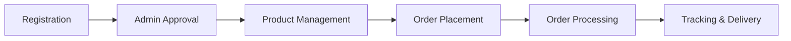

# 🏥 Online Smart Pharma Management Application

[](https://www.oracle.com/java/)
[](https://www.mysql.com/)
[](https://getbootstrap.com/)

> A comprehensive web-based B2B pharmaceutical supply chain management system with role-based access control and real-time order tracking.

## 📋 Table of Contents
- [Overview](https://github.com/Vedant-Kengale/Online-Smart-Pharma-Management-App/blob/main/README.md#-overview)
- [Key Features & Modules](https://github.com/Vedant-Kengale/Online-Smart-Pharma-Management-App/blob/main/README.md#-key-features--modules)
- [Technology Stack](https://github.com/Vedant-Kengale/Online-Smart-Pharma-Management-App/blob/main/README.md#%EF%B8%8F-technology-stack)
- [System Architecture](https://github.com/Vedant-Kengale/Online-Smart-Pharma-Management-App/blob/main/README.md#%EF%B8%8F-system-architecture)
- [Modules](https://github.com/Vedant-Kengale/Online-Smart-Pharma-Management-App/blob/main/README.md#-modules)
- [Usage](https://github.com/Vedant-Kengale/Online-Smart-Pharma-Management-App/blob/main/README.md#-usage)
- [Screenshots](https://github.com/Vedant-Kengale/Online-Smart-Pharma-Management-App/blob/main/README.md#-screenshots)
- [Benefits & Impact](https://github.com/Vedant-Kengale/Online-Smart-Pharma-Management-App/blob/main/README.md#-benefits--impact)
- [Target Users](https://github.com/Vedant-Kengale/Online-Smart-Pharma-Management-App/blob/main/README.md#-target-users)

## 🎯 Overview

**Domain:** Healthcare & Pharmaceutical Supply Chain Management

Project Description:
Developed a web-based B2B pharmaceutical supply chain management system featuring role-based access for Admin, Manufacturer, and Wholesaler modules. The application streamlines pharmaceutical distribution by enabling admin-controlled user verification, product catalog management by manufacturers, and seamless procurement by wholesalers with real-time order tracking capabilities.

### Problem Statement
The pharmaceutical supply chain traditionally faces challenges including:
- Lack of transparency in transactions
- Inefficient communication between stakeholders
- Manual order tracking processes
- Delayed approval and verification processes
- Absence of centralized digital platform

This application addresses these challenges through automation and digitalization.

## ✨ Key Features & Modules

### 🔐 Admin Module
- ✅ User account verification and approval system
- 📊 Status management (Active/Pending/Rejected) for manufacturers and wholesalers
- 📈 Dashboard for monitoring all registered entities
- 🛡️ Regulatory oversight and access control management

### 🏭 Manufacturer Module
- 🔒 Secure registration and sign-in system
- 📦 Product catalog management (Add, Update, Delete products)
- 📋 Order management dashboard to view incoming orders
- 🚚 Real-time order tracking functionality
- 🔄 Track status update capability to inform wholesalers
- 📊 Inventory and product information management

### 🛒 Wholesaler Module
- 👤 Registration and authentication system
- 🔍 Product browsing and search functionality
- 🛍️ Shopping cart and order placement system
- 📜 Order history and tracking interface
- 💼 Purchase management dashboard

## 🛠️ Technology Stack

### Frontend
| Technology | Purpose |
|------------|---------|
| HTML5 | Structure and semantic markup |
| CSS3 | Styling and responsive design |
| JavaScript | Client-side functionality and interactivity |
| jQuery | DOM manipulation and AJAX operations |
| Bootstrap | Responsive UI framework and pre-built components |

### Backend
| Technology | Purpose |
|------------|---------|
| JSP (JavaServer Pages) | Server-side dynamic web page generation and business logic |

### Database
| Technology | Purpose |
|------------|---------|
| MySQL | Relational database management system for storing user data, products, orders, and transaction records |

### Architecture
- **MVC (Model-View-Controller)** pattern implementation
- **Client-Server** architecture with multi-tier design
- **Three-tier architecture** for separation of concerns

## 🏗️ System Architecture
```
┌─────────────────────────────────────────────────────────┐
│                   Presentation Layer                    │
│              (HTML, CSS, Bootstrap, jQuery)             │
└────────────────────────┬────────────────────────────────┘
                         │
┌────────────────────────▼────────────────────────────────┐
│                   Application Layer                     │
│              (JSP, JavaScript, Business Logic)          │
└────────────────────────┬────────────────────────────────┘
                         │
┌────────────────────────▼────────────────────────────────┐
│                      Data Layer                         │
│                   (MySQL Database)                      │
└─────────────────────────────────────────────────────────┘
```

## 📦 Modules

### Functional Workflow


1. **Registration Phase:** Manufacturers and Wholesalers register on the platform with necessary business credentials
2. **Approval Phase:** Admin reviews registration requests and assigns status (Active/Pending/Rejected)
3. **Product Management:** Approved manufacturers add pharmaceutical products with details to the system
4. **Procurement Phase:** Active wholesalers browse products and place orders
5. **Order Processing:** Manufacturers receive orders, process them, and update tracking status
6. **Tracking & Delivery:** Both parties can track order status in real-time until completion

## 💻 Usage

### For Admin
1. Login with admin credentials
2. Navigate to the dashboard to view pending registrations
3. Approve or reject manufacturer/wholesaler accounts
4. Monitor all system activities

### For Manufacturer
1. Register with business details
2. Wait for admin approval
3. Login after activation
4. Add products to catalog
5. Manage incoming orders
6. Update order tracking status

### For Wholesaler
1. Register with business credentials
2. Wait for admin approval
3. Login after activation
4. Browse product catalog
5. Add items to cart and place orders
6. Track order status in real-time

## 📸 Screenshots

> Add screenshots of your application here
```
[Admin Dashboard]     [Manufacturer Panel]     [Wholesaler Interface]
```

## 🎯 Benefits & Impact

| Benefit | Impact |
|---------|--------|
| **Efficiency** | Reduces manual paperwork and streamlines supply chain operations |
| **Transparency** | Provides real-time visibility into order status and inventory |
| **Regulation** | Ensures only verified businesses participate in transactions |
| **Scalability** | Web-based architecture allows easy expansion and remote access |
| **Traceability** | Complete audit trail of all transactions and status changes |
| **Cost Reduction** | Minimizes operational costs through automation and digital processes |

## 👥 Target Users

- 🏛️ Pharmaceutical Administrators and Regulatory Bodies
- 🏭 Pharmaceutical Manufacturing Companies
- 🏪 Medical Wholesalers and Distributors
- 📊 Healthcare Supply Chain Managers

## 🔮 Future Enhancements

- [ ] Mobile application development
- [ ] Integration with payment gateways
- [ ] AI-based demand forecasting
- [ ] Multi-language support
- [ ] Advanced analytics and reporting
- [ ] Email/SMS notifications
- [ ] Document management system
- [ ] Integration with third-party logistics

## 💻 Technical Implementation

The application employs a three-tier architecture where the presentation layer (HTML/CSS/Bootstrap) handles user interface, the application layer (JSP/JavaScript) manages business logic and session handling, and the data layer (MySQL) ensures persistent storage. AJAX calls powered by jQuery enable asynchronous communication for seamless user experience without full page reloads. The system implements role-based access control ensuring each user type can only access their designated functionalities.

## 📝 License

This project is licensed under the MIT License - see the [LICENSE](LICENSE) file for details.

## 👨‍💻 Author

**Your Name**
- GitHub: [@Vedant Kengale](https://github.com/Vedant-Kengale)
- LinkedIn: [Vedant Kengale](https://linkedin.com/in/Vedant-Kengale)
- Email: vedantkengale96@gmail.com

Target Users

- Pharmaceutical Administrators and Regulatory Bodies
- Pharmaceutical Manufacturing Companies
- Medical Wholesalers and Distributors
- Healthcare Supply Chain Managers
